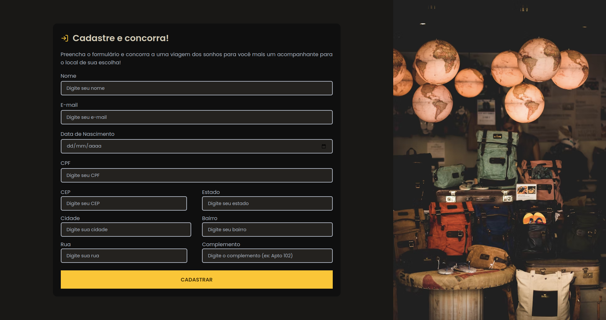
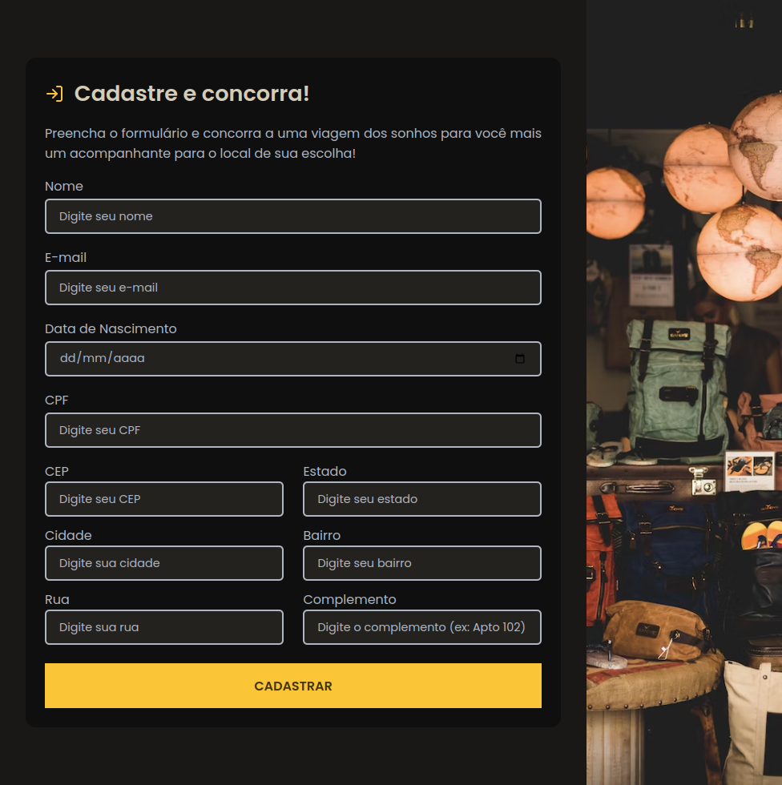
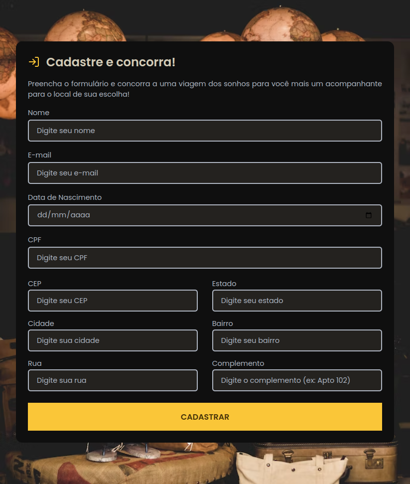
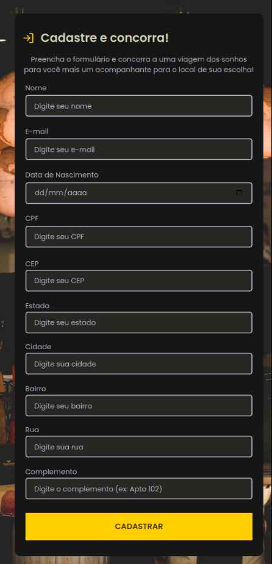

<h1 align="center"> Preencha e concorra a uma viagem! ✈️ </h1>

## Descrição ✏️

A página desenvolvida representa um formulário onde o usuário irá preencher suas informações pessoais para concorrer a uma viagem para um local de sua escolha. Esse projeto foi realizado a fim de desenvolver habilidades em JavaScript para verificar a autenticidade das informações preenchidas pelo usuário, como e-mail, data de nascimento, CPF e CEP.

## Preview 🔎

Preview do projeto em todos os tamanhos de tela:

- Laptop L (1440px)
- Laptop (1024px)
- Tablet (768px)
- Laptop L (425px)

  
  
  
  

## Tecnologias ⚒️

O projeto foi desenvolvido com as seguintes tecnologias:

- HTML
- CSS
- JavaScript
- DOM
- Git e GitHub

## Recursos adicionais 💡

Além da verificação das informações do usuário realizadas na hora do preenchimento do formulário, o mesmo só é enviado apenas quando as informações estão de acordo com os padrões estipulados. Também foi realizado o armazenamento dessas informações no localStorage, assim, se um novo usuário for se cadastrar e o cpf informado já estiver cadastrado, a página emite um alert informando o usuário que o cpf informado já está cadastrado no sistema, solicitando assim, que o usuário informe um novo cpf.

